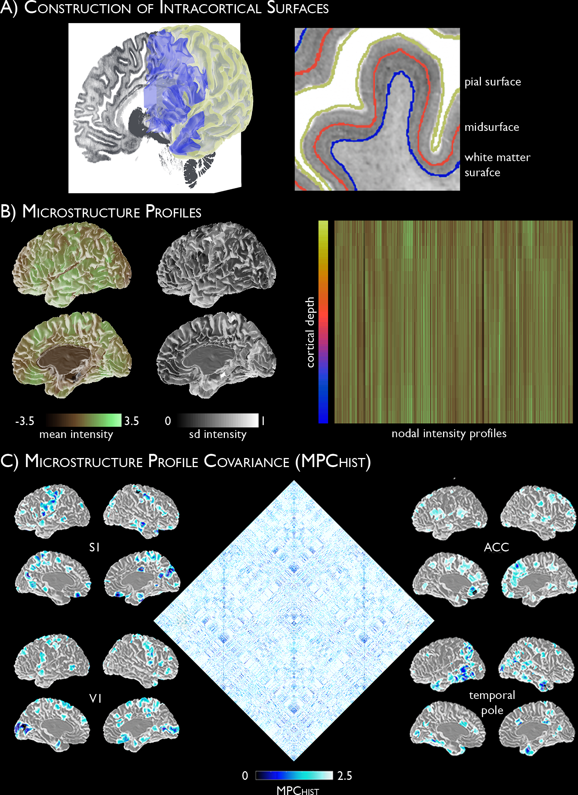

Microstructural profile covariance (MPC), using BigBrain
=============

    
This repo contains 
_____________   

BigBrain Intensity profiles (parcels x s, where s represents a equivolumetric surface)   
Statistical moments (parcels x m, where m represents the moments: mean, SD, skewness and kurtosis)  
Microstructure profile covariance (MPC) matrices (parcels x parcels, in the same order as profiles)

Profiles and moments are available with and without regression for the midsurface y-coordinate. 

Two types of surface construction
_____________

The profiles were generated by sampling Big Brain intensities along equivolumetric surfaces at 163,842 matched vertices per hemisphere.

The purely equivolumetric approach utilises the original gray and white matter surfaces released with BigBrain. We generated 18 equivolumetric surfaces in between these, and removed the most upper and lower to mitigate the influence of partial volume effects. 

The laminar-based approach involved the construction of six equivolumetric surfaces between layer 1 and layer 4, and layer 4 and white matter. Thus the eighth surface is layer 4.  The layer 1/2 boundary and layer 4 peak rely on an automateed layer detection algorithm (Wagstyl, 2018), which performs well in eulaminate cortex but is not validated for use in dysgranular and agranular cortex.  

References
_____________

* Paquola et al., (2019) - original deployment of the BigBrain profiling and microstructure profile covariance (https://doi.org/10.1371/journal.pbio.3000284)
* Paquola et al., (2019) - original implementation of moment-based characterisation of the depth profiles (https://doi.org/10.1101/706341)
* Amunts et al., (2017) - data descriptor of BigBrain (https://doi.org/10.1126/science.1235381)
* ftp://bigbrain.loris.ca/ - BigBrain on Loris 
* Wagstyl et al., (2018) - automated detection of layer 1/2 boundary and layer 4 peak (https://doi.org/10.1093/cercor/bhy074)
* Schaefer et al., (2018) - Schaefer parcellation (https://doi.org/10.1093/cercor/bhx179), with the repo here https://github.com/ThomasYeoLab/CBIG/tree/master/stable_projects/brain_parcellation/Schaefer2018_LocalGlobal
* Glasser et al., (2016) - Glasser parcellation (https://doi.org/10.1038/nature18933)

MOST IMPORTANTLY: 
_____________
We've recently expanded the contents of this repository into an entire toolbox, called "BigBrainWarp" 🎉. It contains a whole suite of tools and resources to help perform microstructural and integrative BigBrain-MRI analyes. So, what are you still doing here? Go to https://bigbrainwarp.readthedocs.io/

If that doesn't fulfill all your microstructural desires, then maybe you need in vivo imaging data and pipelines. In that case see the MICs dataset (https://portal.conp.ca/dataset?id=projects/mica-mics) and the mica-pipe (https://github.com/MICA-MNI/micapipe).

For any other questions, get in touch via casey (dot) paquola (at) gmail (dot) com

